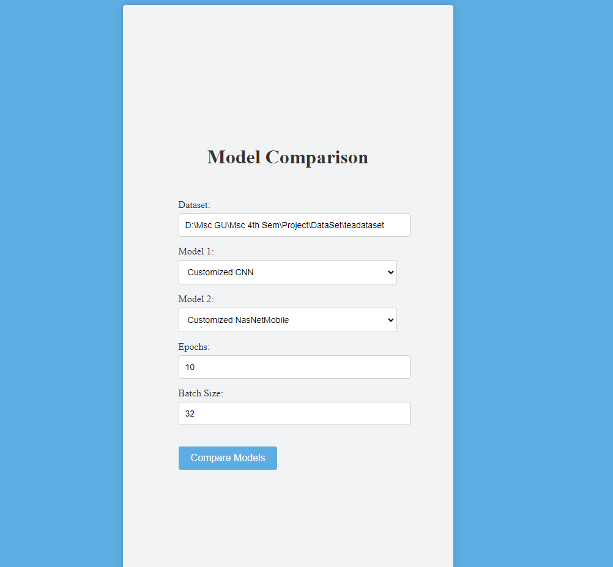
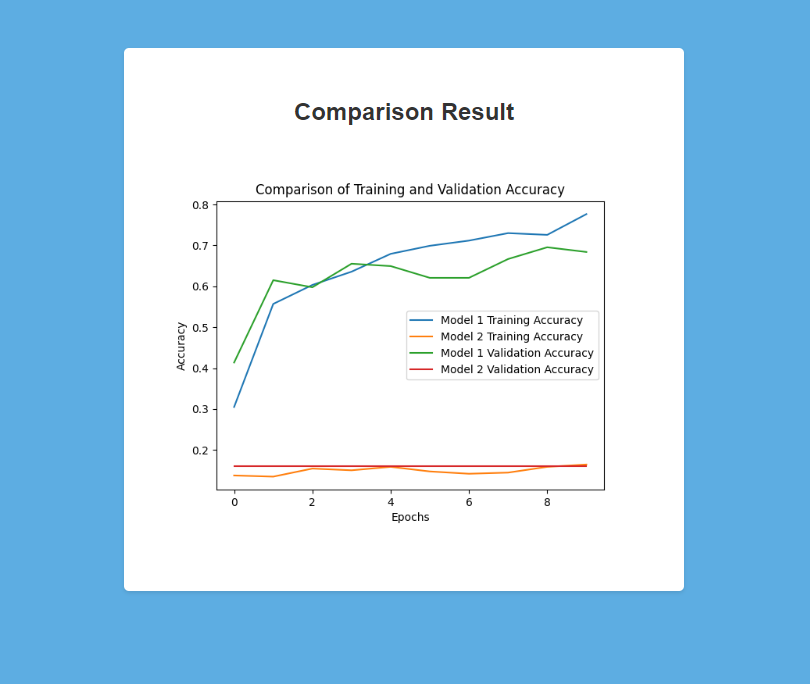
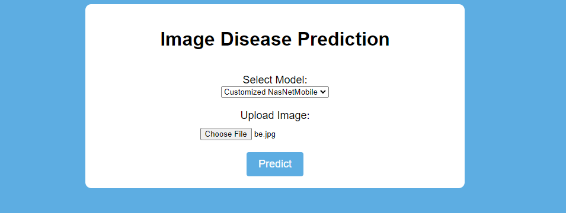
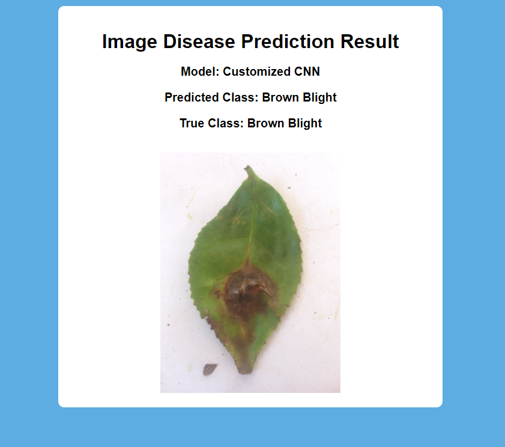

# Tea-Leaf-Disease-Detection
This repo contains the code and documentation for my final year project on tea leaf diseases using deep learning as a partial fulfillment of my degree of master in science in information technology from the department of computer science, Gauhati university, Ghy-14

## Dataset
I used a publicly available dataset for tea leaf disease detection. The dataset is available in the `data` directory.

## Notebooks

We trained four different machine learning models to classify tea leaf diseases. The models are saved in the `saved_models` directory. For more details about the models and their performance, refer to the project proposal/project report in the `documentation` directory.

- `VGG16withCustomLayers.ipynb`: Jupyter Notebook for tea leaf disease detection using transfer learing technique: base model as VGG16.
- `NasNetWithCustomLayers.ipynb`: Jupyter Notebook for tea leaf disease detection using transfer learing technique: base model as NasNetMobile.
- `InceptionV3.ipynb`: Jupyter Notebook for tea leaf disease detection using transfer learing technique: base model as InceptionV3.
- `Mysequential.ipynb`: Jupyter Notebook for tea leaf disease detection using sequentail personal customized CNN model.

## Saved Models
The trained models are saved in the `saved_models` directory.

## Web Application
We have developed a web application to allow users to interact with the trained models and get predictions for tea leaf diseases.

### Web Application Features

- Home Page: The home page allow user to upload a dataset path or link and allow user to choose two trained models among the four machine learning models.

- Comapre Page: The compare page shows the comparesion graph of the two selected models by the user in the home page along with the hyparperameters. 

- Predict  Page: Users can select any model among the four train/saved model and give input images of tea leaf to detect the tea leaf disease

- Result Page: Users get predictions for the type of disease affecting the tea leaves.

### Screenshots

## Documentation
The `documentation` directory contains my project proposal, Report and assests. For more detailed information about the project, you can refer to the following documents:

- [Project Proposal](documentation/project_proposal.pdf)
- [Project Report](documentation/project_report.pdf)
- [Assets](documentation/assets)

## How to Use

### Installation

Make sure you have the required version of Python (e.g., Python 3.7 or later) installed before proceeding.

1. To use this project, you need to have Python installed on your system.
   
2. Install the required dependencies using the following command: `pip install -r requirements.txt`

3. Open your terminal, navigate to where you want to save the project and and Clone this repository using `git clone https://github.com/jenishborah/Tea-Leaf-Disease-Detection`

4. Open and run the Jupyter Notebooks in the `notebooks` directory in the specified order.

#### Running the Web Application

1. Navigate to the `web_app` directory.

2. Run the Flask application: `main.py`
   
3. Open your web browser and go to `http://localhost:5000` to access the web application.

## License
This project is licensed under the MIT License - see the [LICENSE](LICENSE) file for details.

Copyright (c) 2023 <Jenish> Jenish A borah  </Jenish>
